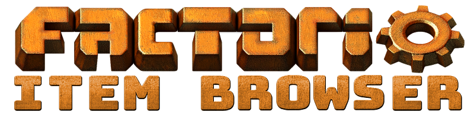

# Documentation

This repository is meant to be a centralized documentation of the Factorio Item Browser project and all its components,
so that not every component repository has its own wiki and information are all over the place.
 
### Please look into the [wiki](https://github.com/factorio-item-browser/documentation/wiki) of this repository for a detailed documentation of how the whole thing works.

This repository also doubles as generator for the customized Swagger UI files for the APIs, linked in the wiki.

## About

The Factorio Item Browser, or short FIB, is a web-based browser of all the items and recipes of the 
[Factorio](https://www.factorio.com/) game, including the ability to add mods as well. Factorio is a game about 
automation and crafting, and keeping an eye on all the items and recipes can be quite difficult, especially when 
dozens of mods are loaded, making the items become thousands. And while you are reading this, your factory is running 
low on iron.

The website can be best described as a web version of ingame mods like [FNEI](https://mods.factorio.com/query/FNEI) and 
[What is it really used for?](https://mods.factorio.com/mod/what-is-it-really-used-for). These kinds of mods are limited
by what the game API offers, and cannot live to their best of intentions. Especially searching for the localised names
of items is difficult or impossible to implement because of these limitations: Searching for "Eisen" (German for iron)
will not yield any results in FNEI, for example. Moving the search to the web enables all kind of new features -- and
a lot of challenges.

## Features

- **Web-based:** The FIB runs completely in your browser. There is no need to have Factorio at all, as the FIB will take 
  care itself of how to get all the required data. Ever wanted to continue planning your factory while commuting? Pull
  out your phone and browse the next items to automate. And hey, "Eisen" will list all the iron stuff, if you changed 
  the language to German in the settings.
  
- **Customizable mods:** After [investing a little more than an hour to beat the Vanilla game](https://www.factorio.com/blog/post/fff-344),
  the next step is of course to add some mods. One major intention of the FIB is to allow the player -- that is you --
  to define what mods to use, and have all their data available. While this cannot be done in real-time, the FIB tries
  its best to export the data in the background from the game, and present it to you after let's say an hour.

- **Multiple settings:** We all know that playing only a single mod-pack is boring. Better have dozens installed and
  confuse everything with each other. Even then the FIB is prepared: It allows you to create several settings, with 
  only a view clicks to switch between them. 
